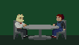
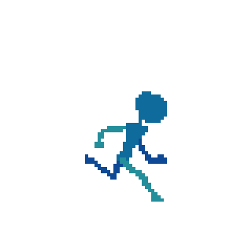
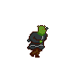
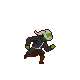
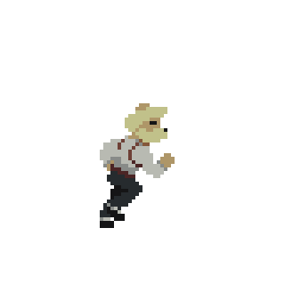

<!-- GitHub does support css definitions in markdown so all styles are inline.-->

# Unannounced Indie Game

This is a summary of my experience working on my long-term game development project for over two years. It represents my journey as a programmer and artist. It is very much a work in progress and I will continue to work on it into the foreseeable future.
I hope to... No. I know I will someday publish it.

Notable features right now include satisfying platforming physics, the beginnings of a combat system, several plugins for Godot Engine, a well-fleshed out character dialog system, a developer console, a custom framedata editor, and some cutscenes.

This repository is a brief reflection on my experience thus far, and will be infrequently updated. I work on the game itself daily.

## Inspiration
When I was in high school, I played a fair bit of *Super Smash Brothers*. I liked the ease-of-control and satisfying combos the game enables, but disliked how fast-paced it is. Oftentimes I felt I was surrendering conscious control of characters to muscle memory and was disengaging from the game. This is not only *Smash Bros*'s problem, but a problem shared by most online multiplayer games. Because of this, as I've become older I've gravitated towards single-player experiences.

I've always admired action platformers for their ability to take a core concept that is so simple and evoke a thousand different emotions with it. From the wonder of *Super Mario Odyssey* to the playfulness of *Kirby and the Forgotten Land* to the quiet, contemplative caverns of *Hollow Knight*, such games allow the player to explore their worlds in a way that is very tangible while also giving room for experimentation and creativity.

I have also always had a fascination with how the internet affects the human psyche and can draw out the best and worst in people. I wish to explore this in my game through characters that personify people's behavior online and with combat that evokes the weird and wacky history of the internet and the wonderful artistry it enables.

The game's premise is currently top-secret information. Despite being ridiculous, it takes itself very seriously. When I announce it, I hope you all will think it is not only funny but also thought-provoking. The game strongly emphasizes narrative through both dialog and environmental storytelling that seamlessly intertwines with its rich combat and exploration.

## My Programming Journey
I came into this project with very little knowledge. I had only taken up to my high school's data structures course. My initial project was made in Gamemaker Studio 2. While this attempt was valiant, it had the hallmarks of a beginner project. There were weird pseudo-multi-inheritance hierarchies enabled by dynamic typing, an abundance of redundant comments, an abuse of magic strings, and other strange workarounds to problems of my own invention.

Around 5 months into the project, I decided to switch engines to Godot with C#. My reasons for doing so at the time were ill-informed, but I made the right decision as learning C# got me more interesting in programming methodology (as well as understanding the benefits of a semi-decent static type-checker). I researched object-oriented programming and tried with varying degrees of success to incorporate what I had learned into my project.

9 months into the project, I became interested in functional programming after having bugs related to data structures being mutated and ending up in invalid states. 
The culmination of this was the creation of a custom text markup system in F# for annotating character dialog with effects such as color changes and shakes and rendering it on screen. This also taught me better project management skills as I sunk 4 months focusing on dialog and internationalization when I didn't really have a game in the first place.

Recently, I have begun to consolidate my knowledge to try to work more quickly. I have come to realize that programming methodologies were created to solve very real problems, but often come with additional baggage in terms of complexity that one must understand before using them. Everything is a means to create the simplest code possible. The only thing that really matters is shipping a successful game.

As I added more attacks to my characters, I became frustrated with the limitations of the process I was using, which involved using Godot's built-in animation playback features. It was tedious and time-consuming, with something as simple as a rename having seven different steps that required editing multiple configuration files. Recently, I decided to make a simple framedata editor to remedy this. It has no dependencies on the game and I chose to write it in C to improve my systems-programming skills. You can view this on my GitHub page. In about a week of working on it I had a timeline with multiple hitbox and hurtbox layers, three different shape types with draggable handles to adjust their size and position, undoing and redoing all editor actions, and serialization and deserialization. As I flesh out game combat, I will continue to add features to this editor as my needs become more apparent.

## My Artistic Journey
When I began this project, my interest in pixel art was minimal as I wanted to focus on programming and my lack of art skill was discouraging. However, as I learned more about game development, I was forced to confront the reality of the sheer amount of artwork I needed to produce to ship this game. During 2022, I focused much more on pixel art and animation as a result. I believe I made much progress as an artist and animator during this time.

I have to thank Adam C. Younis's wonderful video on his own progress in pixel art animation as inspiration for this section. <!-- credit his tutorials as well -->

| 
 Samples (oldest to newest) |                                                                                                                                                                                                                                                   Information                                                                                                                                                                                                                                                    |
|:-----------------------------------------------------:|:----------------------------------------------------------------------------------------------------------------------------------------------------------------------------------------------------------------------------------------------------------------------------------------------------------------------------------------------------------------------------------------------------------------------------------------------------------------------------------------------------------------:|
|          |                                                                                                                                                  I made this first animation in early 2021 as a placeholder. I had no idea what I was doing, and just copied stick-figure run cycle animations from Google. This is a beginner's effort, and it clearly shows.                                                                                                                                                   |
|                 | Though these next two animations are fan-art sprites of a meme Youtube series featuring Shrek, I think they accurately represent my journey as an artist at this time. I made this first one in mid-2021, and is an evolution of the beginner's methodology demonstrated by the first image. I animated this straight-ahead on one layer. While the motion of each individual limb is somewhat smooth, there is a lack of cohesion in the overall image as well as some strange artefacts in the sword and head. |
|   |                I made this next animation in early 2022. It is the first I made with a more iterative approach, starting with blobs of color for each limb and refining it. Only when I was satisfied with this initial version would I add the details. I am quite proud of how easy it is to trace the motion of the hair, arms, and kilt in this sprite. However, the motion of the legs is still somewhat confusing due to their similiar position and color, and the torso is rather stiff.                 |
|    |             This is the current animation for the player run cycle which I made in December of 2022. The bobbing of the head and shoulders have a tight, rhythmic motion that I believe exudes the slightly-misguided confidence the player character has. The legs and especially the arms are much easier to track because of my more effective use of 3/4ths perspective. I chose to eschew outlines as they noticeably increased the time required to create sprites with little visual impact.              |

## Reflection
This project as been by far the most labor-intensive project I have ever worked on in my life. Despite sometimes becoming discouraged due to my inexperience and the resulting lack of tangible outcomes, I haven't given up for over two years. I know I not only have a vision for a game that satisfies an unfilled niche but that I also have the means to see it through. I have learned much about programming, art, project management, and game design, and I look forward to the day when I can unveil the full game to the world.